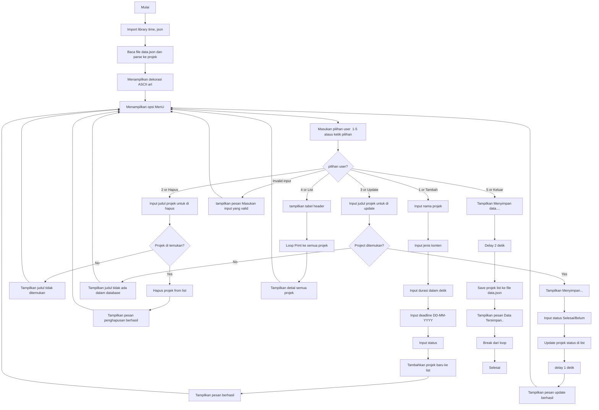

Muhammad Fahriel <br/>
2509116050

<pre> 
 __          __ ______  _       _____  ____   __  __  ______ 
 \ \        / /|  ____|| |     / ____|/ __ \ |  \/  ||  ____|
  \ \  /\  / / | |__   | |    | |    | |  | || \  / || |__   
   \ \/  \/ /  |  __|  | |    | |    | |  | || |\/| ||  __|  
    \  /\  /   | |____ | |____| |____| |__| || |  | || |____ 
     \/  \/    |______||______|\_____|\____/ |_|  |_||______| 
     </pre>

# Program Manajemen Projek Multimedia

Program sederhana berbasis **Python (CLI)** untuk mengelola daftar projek multimedia (Video Editing).  
Dengan fitur **CRUD** (Create, Read, Update, Delete) serta menyimpan data ke file JSON.

# Alur Program

## 1.Home Page
>Menu ini akan tampil pada saat pertama kali program dijalankan, User dapat memilih opsi dengan memasukan input nomor ataupun mengetik 
 <br/>
                        
## 2.Menu Tambah Projek 
>Menu ini berfungsi untuk menambahkan projek baru dengan detail:
>- **Judul**
>- **Jenis Konten** (Vlog, Short Movie, Dokumenter, Youtube, Reels, dll.)
>- **Durasi** (detik)
>- **Deadline** (DD-MM-YYYY)
>- **Status** (Selesai/Belum)
>

## 3.Menu Hapus Projek
>Menu ini berfungsi untuk menghapus projek dengan memasukan judul
>

## 4.Menu Perbarui Projek  
Alur:
1. Masukkan **judul** projek yang ingin diperbarui.  
2. Jika ditemukan, masukkan **status baru** (Selesai/Belum).  
3. Data lain (judul/jenis/durasi/deadline) **tetap**, hanya status yang berubah.

> Catatan: Pencarian berdasarkan **judul** bersifat case-sensitive


## 5.Menu List Projek 
>Menu ini berfungsi untuk menampilkan seluruh projek yang tersimpan dalam bentuk tabel.  


## 6.Menu Keluar 
 >Menu ini berfungsi untuk keluar dari program sekaligus save file ke json


# Penjelasan Kode <br/>
```
import time
import json
#json read file sbagai isi list 
with open('data.json', 'r') as f:
    projek = json.load(f)
```
Modul time digunakan untuk memberik jeda  atau delay yang bersifat estetika saja dalam proses eksekusi.
Modul json digunakan untuk membaca serta menulis data projek ke dalam file eksternal agar data tidak hilang saat program keluar / exit.

Pada awal program, file data.json dibuka dan dibaca untuk mengisi variabel projek. Variabel ini berupa sebuah list yang berisi data projek dalam bentuk tuple/list lima elemen: (judul, jenis, durasi, deadline, status).

```
print (""" ...ASCII... """)
while True:
    print("")
    print("-" * 38)
    print(f"|Program manajemen projek multimedia |\n| {"1.Tambah projek":<34} |\n| {"2.Hapus projek":<34} |\n| {"3.Update Projek":<34} |\n| {"4.List Projek":<34} |\n| {"5.Keluar" :<34}|")
    print("-" * 38)

    userchoice = input("Pilih 1-5 atau Ketik opsi\n>>>")
```
kode di atas mencetak ASCII art (dekorasi) di menu utama,
kemudian menjalankan Infinite loop agar program terus menampilkan menu sampai user memilih Keluar.
print(" ") dengan "-"*38 membuat  bingkai menu agar terlihat rapih.
f-string dengan ":<34" artinya mencetak rata kiri agar tulisan sejajar.
kemudian meminta input dari user (angka "1"–"5" atau teks seperti "Tambah").

```
    if userchoice == "1" or userchoice == "Tambah":
        namaprojek = input("Masukan nama projek:\n>>>")
        jeniskonten = input("Masukan jenis konten: \n Vlog, Short Movie, Dokumenter, Youtube, Reels, lainnya \n>>>")
        durasi = input ("Masukan durasi konten (dalam detik):\n>>>")
        deadline= input("Masukan deadline projek (DD-MM-YYYY):\n>>>")
        status = input("Masukan status:\n>>>")
        projek.append((namaprojek, jeniskonten, durasi, deadline, status))
        print(f"Berhasil ditambahkan: {namaprojek} | {jeniskonten} | {durasi} detik | {deadline} | {status}")
        
```
Pada bagian ini, user diminta memasukkan lima komponen utama dari suatu projek yaitu judul,  jenis, durasi, deadline, dan status.
Data yang dimasukkan akan disimpan dalam bentuk tuple, kemudian ditambahkan ke dalam list projek dengan menggunakan fungsi .append().
Program menampilkan kembali data yang baru ditambahkan sebagai bentuk konfirmasi bahwa proses "Create" telah berhasil.


```
 elif userchoice =="2" or userchoice== "Hapus":
        cari = input("Masukkan judul projek yang mau dihapus: ").strip()
        pencarian =next((i for i, t in enumerate(projek) if t[0] == cari), None)
        if pencarian is None:
            print("Judul tidak ditemukan.")
        else:
            terhapus = projek.pop(pencarian)
            print(f"Projek '{terhapus[0]}' berhasil dihapus.")
```

user diminta memasukkan judul projek yang ingin dihapus.
program menggunakan enumerate() untuk mencari indeks projek yang sesuai dengan judul yang dimasukkan. Jika judul tidak ditemukan, maka akan menampilkan pesan kesalahan.
Jika ditemukan, projek nya akan dihapus dengan metode .pop(), dan program menampilkan judul projek yang berhasil dihapus.

```
elif userchoice == "3" or userchoice=="Update":
    update= input("Masukan judul projek yang ingin di perbarui\n>>").strip()
    pencarian = next((i for i, t in enumerate(projek) if t[0] == update), None)
    if pencarian is None: 
        print("Judul tidak ada dalam database!!!")
    else: 
        inputstatus = input("Update Status (Selesai/Belum) \n>>") 
        projek[pencarian] = (projek[pencarian][0], projek[pencarian][1], projek[pencarian][2], projek[pencarian][3], inputstatus)
        print(f"projek '{update}' berhasil di perbarui ")
```
user memasukkan judul projek yang ingin diperbarui statusnya.
program kembali menggunakan pencarian indeks untuk menemukan projek yang dimaksud.
Jika ditemukan, elemen status pada tuple diganti dengan input yang dimasukkano oleh user.
Program kemudian menampilkan pesan konfirmasi bahwa status telah berhasil diperbarui.

```
elif userchoice =="4" or userchoice=="List":
    print("-" * 100)
    print(f"{'Projek':<27} | {'Jenis':<12} | {'Durasi':<12} | {'Deadline':<15} | {'Status':<10}" )
    print("-" * 100)
    for i in projek:
        print(f"{i[0]:<28}| {i[1]:<13}| {i[2]:<12} | {i[3]:<15} | {i[4]:<10}")
    print ("-" * 100)
```
Program menampilkan seluruh data projek dalam bentuk tabel dengan kolom: Judul, Jenis, Durasi, Deadline, dan Status.
Format string dengan spesifikasi :<width digunakan agar setiap kolom rata kiri dan sejajar.
Fitur ini merupakan implementasi dari Read.


```
elif userchoice == "5" or userchoice=="Keluar":
    print("Menyimpan data....")
    time.sleep(2)
    with open('data.json', 'w') as f:
        json.dump(projek, f, indent=4)
    print("Data Tersimpan..") 
    break

```
Saat user memilih keluar, program menuliskan kembali isi projek ke file data.json menggunakan json.dump().
perintah delay selama 2 detik hanya bermaksud menambah estetika 
Setelah proses penyimpanan selesai, program berhenti melalui perintah break.

```
else:
    print("Masukan input yang valid!")

```
Jika user memasukkan pilihan menu yang tidak valid, program memberikan pesan kesalahan dan menampilkan ulang menu utama.


# Flowchart

flowchart 

